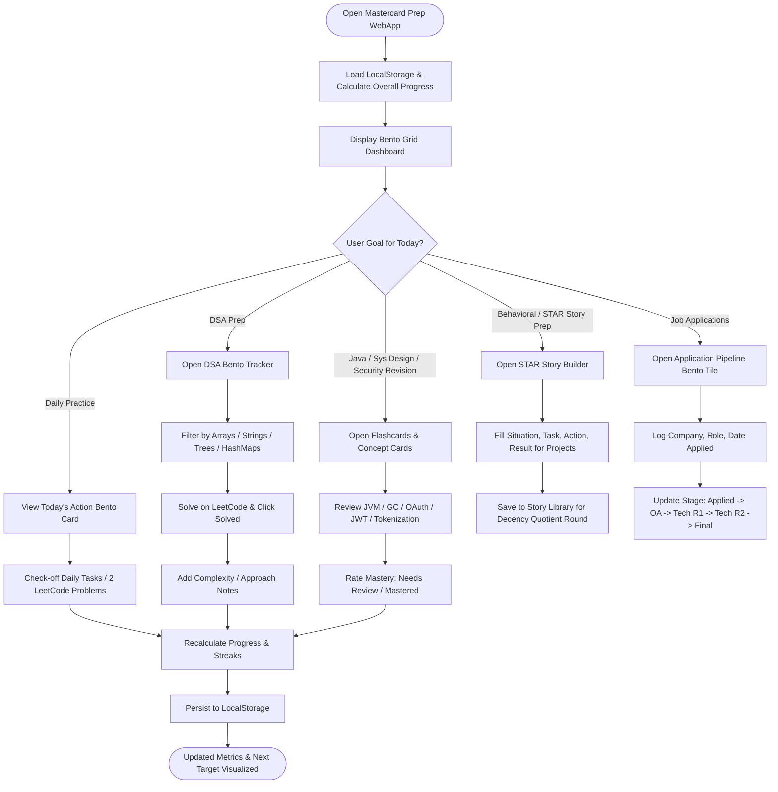

# Mastercard Prep Bento UI WebApp — User & System Workflow (`workflow.md`)

## 1. User Journey & Core Operating Workflow

This workflow documents how Vinit Mahale interacts with the **Bento UI Preparation Tracker** daily across the 6-week timeline.

---

## 2. Detailed Workflows by Feature

### Workflow A: Daily Practice & Plan Execution
1. **Launch App**: User views overall progress percentage and active phase in the Hero Bento Card.
2. **Review Action Tile**: Today's 2 target problems or study goals are highlighted.
3. **Execute & Check**: Checking off tasks instantly recalculates streak count and updates the progress ring with interactive sound/visual feedback.

### Workflow B: DSA Problem Tracking & Notes
1. **Select Category**: Filter problems by category (Arrays & Strings, HashMaps, Recursion, Sorting, Trees, Linked Lists).
2. **Access Links**: Click external button to jump directly to LeetCode problem.
3. **Log Notes**: Write quick bullet points (e.g., "Two pointers, O(N) time, O(1) space") directly into the problem drawer for last-minute interview revision.

### Workflow C: Java & Security Concept Mastery
1. **Select Week**: Navigate to Week 3 (Java Internals) or Week 5 (Security & Payments).
2. **Flip Flashcards**: Flip interactive cards for topics like JVM Memory (Stack vs Heap), HashMap collision resolution, OAuth 2.0 vs OIDC, and Payment Tokenization.
3. **Self-Grade**: Update mastery state to ensure weak areas resurface until mastered.

### Workflow D: STAR Behavioral & Decency Quotient (DQ) Builder
1. **Choose Prompt**: Select common interview themes (e.g., Flutter to Supabase migration, handling ambiguity, team collaboration).
2. **Structured Input**: Fill fields for Situation, Task, Action, Result.
3. **Quick Review**: Access structured cheat sheet before Technical Round 2 and Final HR/DQ rounds.

### Workflow E: Application Pipeline Tracking
1. **Log Application**: Enter company name, role, date applied, and job referral status.
2. **Pipeline Progression**: Advance candidate status through OA, Technical Round 1, Technical Round 2, and Final Round.
3. **Summary KPI**: View total applications, active interviews, and conversion metrics in the pipeline Bento card.
